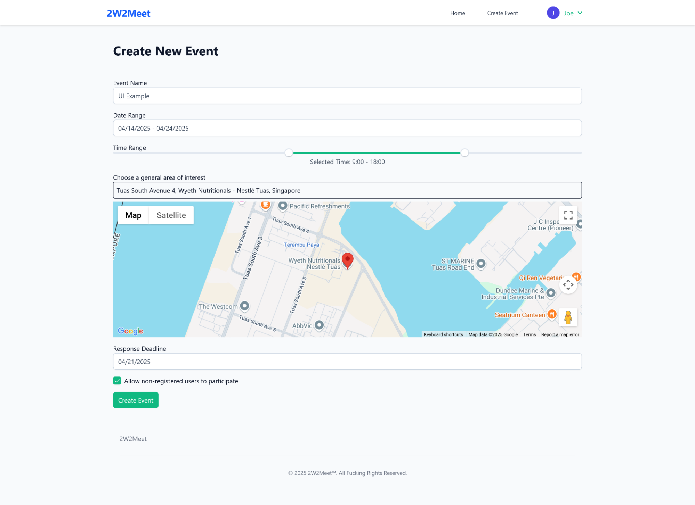
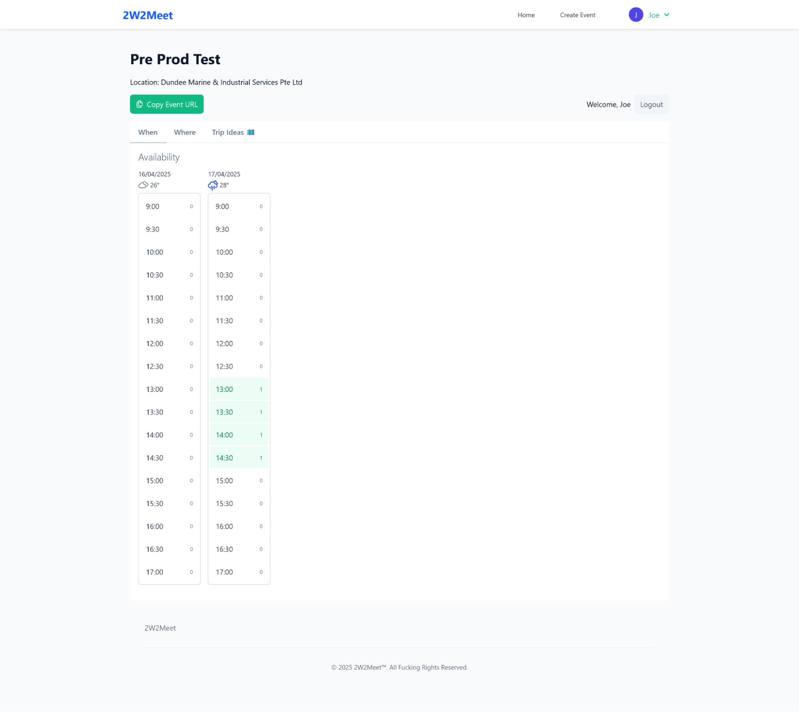
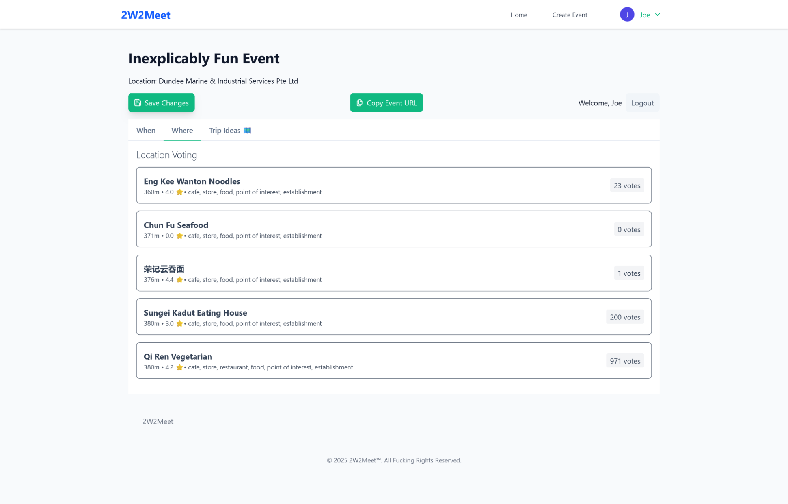
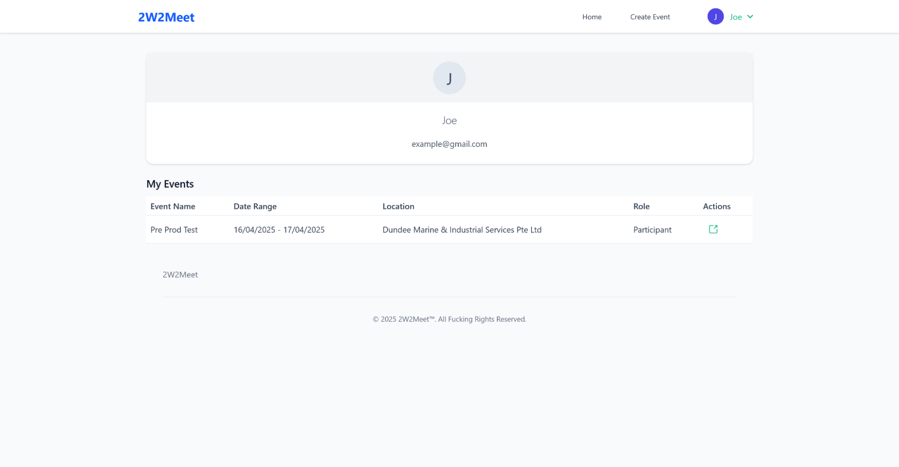
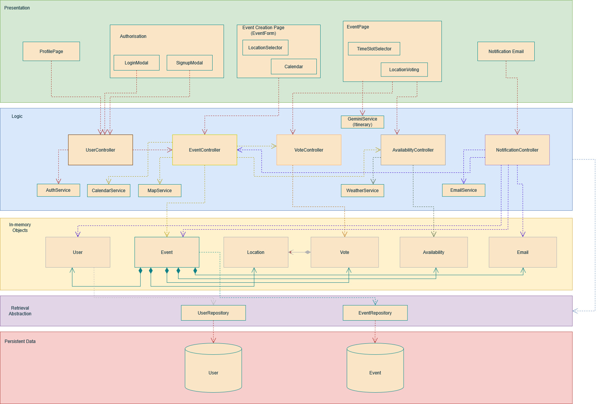

# 2W2Meet - Group Event Planning Made Simple

An implementation of a meeting scheduler like when2meet, enhanced with location information & selection. Find both when and where to meet.

This was a group project for our Software Engineering course (SC2006).
**[Demo Video](https://www.youtube.com/watch?v=NZapr3wwRM4)**

## Key Features

- **Dynamic Schedule Coordination:** An interactive grid allows users to click and drag to select their available time slots, with a real-time visualization showing the best times for the group to meet.
- **Smart Location & Event Planning:** Integrates the Google Maps API to suggest nearby venues and uses the Gemini API to generate creative event ideas. The weather forecast is also displayed for selected dates.
- **Simple Event Management:** Invite participants with a unique shareable link—no account required. Event updates are sent automatically via email, and users have a dashboard to view past events.

### In Action:

<table>
  <tr>
    <td align="center"><strong>Create an Event</strong></td>
    <td align="center"><strong>Select Timeslots</strong></td>
  </tr>
  <tr>
    <td></td>
    <td></td>
  </tr>
  <tr>
    <td align="center"><strong>Choose a Venue</strong></td>
    <td align="center"><strong>Manage Events</strong></td>
  </tr>
  <tr>
    <td></td>
    <td></td>
  </tr>
</table>

## System Architecture

The application uses a decoupled client-server architecture. The Vue.js frontend communicates with backend services that manages api calls and firestore, ensuring a scalable and maintainable structure. All data is stored and synchronized in real-time with Firestore.

 

## Tech Stack

- **Frontend:** Vue.js 3, TypeScript, PrimeVue, Tailwind CSS
- **Backend:** Firebase Cloud Functions, Nodemailer
- **Database:** Firebase Firestore (for real-time data)
- **APIs:** Google Maps Places API, Gemini API, Weather API
- **Deployment & Tooling:** Vite, Firebase Emulator Suite

## Challenges & Key Learnings

The primary challenge of this project was managing its complexity, from an efficient data models to the high-level architecture. We had to build a feature heavy app with tricky UI (like the time selection grid between multiple users) and multiple APIs, all while keeping the code clean and easy to maintain.

Two things really stood out:

1.  **Efficient Data Modeling:** On the frontend, instead of storing the entire timeslot grid for every user, we designed a **sparse data model**. We only stored the IDs of selected timeslots per user, which helped reduced data load and made real-time updates fast.

2.  **Modular Backend Architecture:** On the backend, we kept things modular by splitting each service into its own section. This helped keep the logic organized and stopped all our features and API calls from turning into a tangled mess..

Overall, this project provided hands-on experience in applying the principles of clean architecture and efficient data modeling.

## Project Planning & Design
This project was developed following a structured process, including the creation of a detailed [Software Requirements Specification (SRS)](./public/SC2006%20Group%20Proposal.pdf) covering use cases, non-functional requirements, and system design.

<strong>How to Run This Project Locally</strong>

### Frontend Setup
1. Navigate to the frontend directory: `cd ./frontend`
2. Install dependencies: `npm install`
3. Start the development server: `npm run dev`
4. Access the application at `http://localhost:5173`

### Backend Setup
1. Navigate to the backend directory: `cd ./backend`
2. Install dependencies: `npm install`
3. Create a `.env` file and populate it with your API keys.
4. Start the backend services: `npm run dev`

